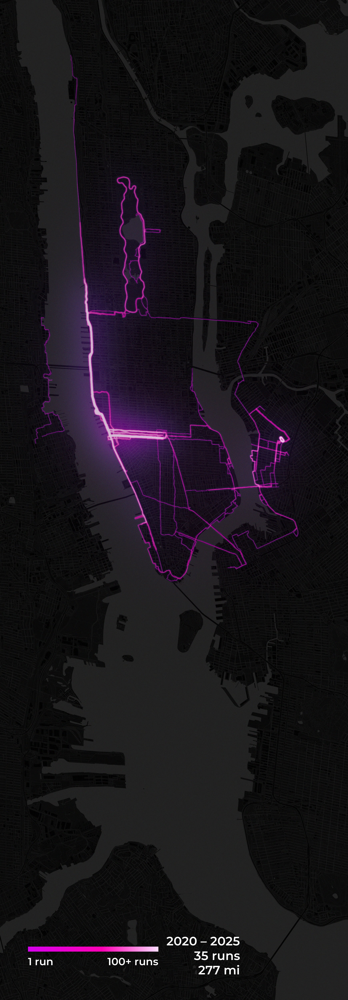

# Strava Heatmap Art

Generate a print-quality running heatmap poster from your Strava data.


NYC is also pre-configured — optimized to show the full NYC Marathon course (Staten Island → Brooklyn → Queens → Bronx → Manhattan), which one day they will let me run.



---

## Prerequisites

- Python 3.11+
- A [Strava](https://www.strava.com) account with running activities

## Setup

```bash
git clone <this-repo>
cd strava-heatmap-art
python3 -m venv .venv
.venv/bin/pip install -r requirements.txt
cp .env.example .env
source .venv/bin/activate
```

## Strava API setup

1. Go to [strava.com/settings/api](https://www.strava.com/settings/api)
2. Create an application (name and website can be anything)
3. Set **Authorization Callback Domain** to `localhost`
4. Copy your **Client ID** and **Client Secret** into `.env`:
   ```
   STRAVA_CLIENT_ID=12345
   STRAVA_CLIENT_SECRET=abc123...
   ```

## Authenticate

```bash
python auth.py
```

Your browser opens the Strava authorization page. Click **Authorize**. The page redirects to localhost and shows "Auth successful! You can close this tab." — your tokens are saved to `.env` automatically. Come back to the terminal; you'll see:

```
✓ Auth complete. Tokens saved to .env
  Athlete: Kev Ay
  Run: python export.py --fetch
```

## Fetch & render

**First run** — fetch activities and render:
```bash
python export.py --fetch
```

**Subsequent runs** — render from cache (fast):
```bash
python export.py
```

**Quick preview** at 1/10 scale for iteration:
```bash
python export.py --preview
```

**NYC render:**
```bash
python export.py --config nyc
```

Output is saved to `output/poster-<timestamp>.png`.

## Adapting for a new city

The recommended approach is to create a `<city>_config.py` that inherits from `config.py` and overrides only the values that differ:

```python
from config import *  # inherit SF defaults

CITY_BOUNDS = {
    "lat_min": 40.575,
    "lat_max": 40.875,
    "lng_min": -74.105,
    "lng_max": -73.730,
}

CANVAS_WIDTH_PX  = 1740   # final output width (after crop)
CANVAS_HEIGHT_PX = 5000   # final output height (after crop)
MAP_TILE_CACHE = "data/map_tile_nyc.png"
```

Then render with:

```bash
python export.py --config nyc
```

NYC comes pre-configured — `nyc_config.py` is included and uses a 29° rotation so Manhattan's street grid runs vertically, with a non-centered crop to frame the borough.

**To configure your own city:**

**1. Geographic bounds** — use [bboxfinder.com](http://bboxfinder.com) to draw your bounding box and set `CITY_BOUNDS`.

**2. Canvas size** — the canvas must match the Mercator aspect ratio of your bounds or the map will be distorted:

```
lng_range_rad  = (lng_max - lng_min) × π/180
merc_max       = arcsinh(tan(lat_max × π/180))
merc_min       = arcsinh(tan(lat_min × π/180))
aspect_ratio   = lng_range_rad / (merc_max - merc_min)   ← width/height
```

Set `CANVAS_WIDTH_PX` and `CANVAS_HEIGHT_PX` so `WIDTH / HEIGHT ≈ aspect_ratio`.

**With rotation** (`CANVAS_ROTATION_DEGREES != 0`): set `CANVAS_RENDER_WIDTH` / `CANVAS_RENDER_HEIGHT` to the intermediate (pre-rotation) canvas dimensions that satisfy the aspect ratio, and set `CANVAS_WIDTH_PX` / `CANVAS_HEIGHT_PX` to your desired final crop size. Use `CANVAS_CROP_X` / `CANVAS_CROP_Y` to shift the crop origin away from center.

**3. Activity filter** — `src/processor.py:filter_sf_runs()` filters by `CITY_BOUNDS` automatically — no code change needed.

## Tweaking visuals

All visual knobs are in `config.py`:

| Variable | What it controls | Safe range |
|---|---|---|
| `GAMMA` | Brightness of rarely-run routes (< 1 lifts dim lines) | 0.3 – 1.0 |
| `ROUTE_LINE_THICKNESS` | Base stroke width in pixels | 1 – 5 |
| `ROUTE_COLOR_RAMP` | Color palette from single-run to peak density | — |
| `HOT_BLOOM_STRENGTH` | Glow intensity on heavily-run corridors | 1.0 – 6.0 |
| `HOT_BLOOM_THRESHOLD` | Density cutoff to trigger hot bloom | 0.5 – 0.9 |
| `MAP_TILE_OPACITY` | How bright the street map shows through | 0.5 – 1.0 |
| `DENSITY_EXPAND_STRENGTH` | How much denser routes appear thicker | 0.5 – 2.0 |
